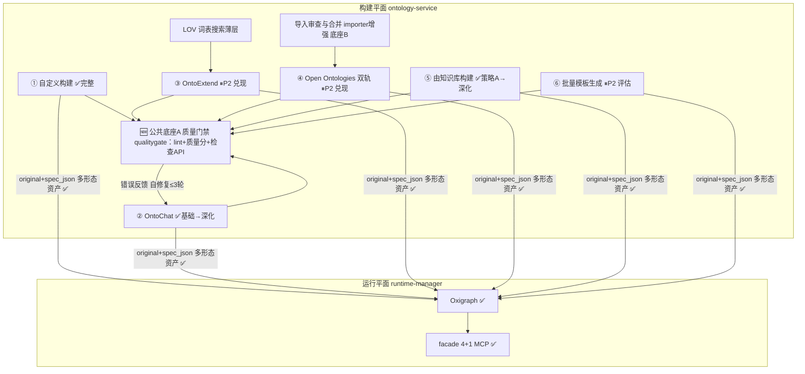

# 26_本体_多途径构建平台可落地方案

> 版本 v1.0 ｜ 2026-09-26 ｜ 立项：REQ-171（方案 only，待拍板排期）
> 方法论：idea-to-feasible-plan Skill（源资料精读 → 实现盘点 → 映射设计 → 约束化方案 → 分阶段路线 → 立项）
> 源资料：[./23_本体_开源实现方案借鉴研究.md](./23_本体_开源实现方案借鉴研究.md)（18 开源方案全景）、[./24_本体_本地工程化落地方案调研.md](./24_本体_本地工程化落地方案调研.md)、[../知识库/25_Agent知识库与知识图谱构建接入方案.md](../知识库/25_Agent知识库与知识图谱构建接入方案.md)、research/本体构建理论论文线综述_20260926.md（LLM 本体构建/本体学习/对话式工程/多源异构四方向论文线）
> 项目基线：[../../docs/03_本体_需求文档.md](../../docs/03_本体_需求文档.md) v0.31、[../../docs/04_本体_方案设计.md](../../docs/04_本体_方案设计.md) v0.22、[../../docs/08_本体_开源复用与自研边界分析.md](../../docs/08_本体_开源复用与自研边界分析.md) v0.2

---

## 1. 定位与研究问题映射

**研究问题（主人原话）**：结合当前项目现有本体相关方案，以构造一个**支持多种途径构建本体的平台**为目标，深入研究业界本体构建实践（开源方案）与理论研究（论文），重新整理输出可落地方案，系统性指导后续工程开发。

**问题分解**：

| 子问题 | 本方案回答位置 |
|---|---|
| 「多种途径」指什么？已有哪些、缺哪些？ | §3 六路径成熟度盘点 |
| 业界最值得吸收的实践是什么？ | §2 双线核心发现 |
| 理论研究对工程设计的支撑？ | §2.2 理论线 |
| 新方案与既有架构的关系？ | §5 总体架构主张（不推翻，分级兑现） |
| 分几期做、每期交付什么？ | §9 分阶段路线 |
| 登记什么需求？ | §10 需求衔接 |

**本方案的定位**：不是对 [../../docs/04_本体_方案设计.md](../../docs/04_本体_方案设计.md) 的推翻重写，而是**面向「多途径构建」这一主目标的收敛视图**——把 04 的全景架构、23 的 18 个开源方案、25 的 KB 接入策略、理论论文线方法论，收敛为一份可排期、可验收、新建模块最少的工程路线。

---

## 2. 双线核心发现（S1 摘要卡）

### 2.1 业界开源实践线

**核心命题：AI 辅助本体构建的唯一可行范式是「LLM 生成 → 工具链验证 → 迭代修复」闭环，单次生成不可用。**

量化证据（[./23_本体_开源实现方案借鉴研究.md](./23_本体_开源实现方案借鉴研究.md) §1/§6.1）：

| 证据 | 数字 | 出处 |
|---|---|---|
| Open Ontologies 闭环效率：LLM+工具链闭环 vs 手工 | 5 分钟完成手工约 4 小时的 91 类本体构建，覆盖率 96% | §6.1 |
| 结构化 MCP 工具访问 vs LLM 直读原始 OWL | F1 0.717 vs 0.323（直读甚至不如裸 LLM 推理 0.431） | §6.1 |
| Open Ontologies 工具链规模 | 39 个 MCP 工具，Terraform 式生命周期（plan/apply/drift） | §6.1 |
| OntoGenix 自修复循环 | 生成→校验→错误反馈→修复，多轮迭代显著降低人工干预 | §6.3 |
| OLIVAW 质量门禁 | 敏捷本体 CI 三模式（单元/静态/演进），OWL 级反模式静态检查 | §3.1 |
| LOV 词表复用 | 词表发现 API 直接可用，复用优先于新建的建模惯例 | §4.1 |

**18 方案优先级收敛**（[./23](./23_本体_开源实现方案借鉴研究.md) §9，已按本项目现状重校）：

- **P0**：AI-native 工具链闭环范式（Open Ontologies）——但它不是「新模块」，而是六条路径共同的设计原则 + 质量门禁底座；
- **P1**：资产质量门禁（OLIVAW+Semantica QualityGate）、本体导入审查（OrionBelt）、LLM 自修复循环（OntoGenix）、LOV 词表搜索、OntoChat 完善、Domain-OntoGen 生成管线；
- **P2**：ROBOT Template 批量生成、ODP 库推荐、WebVOWL 增强、KB Data Pipeline、语义嵌入搜索、协作/语义 Diff/OLS 语义地图；
- **P3**：LinkML（与 spec_json 冲突）、BioPortal Annotator（领域限定）、OntoGraf 增强（锦上添花）。

**KB→KG 接入结论**（[../知识库/25_Agent知识库与知识图谱构建接入方案.md](../知识库/25_Agent知识库与知识图谱构建接入方案.md) §7.3/§8）：D-O14 三策略定案（A RAG 走主平台 / B KG 直转薄映射 / C 混合 nano-graphrag 风格），Go 后端为控制面，Python 重管线走 sidecar；避免引入 Neo4j/KAG/RAGFlow 运行时。

**自研边界**（[../../docs/08_本体_开源复用与自研边界分析.md](../../docs/08_本体_开源复用与自研边界分析.md) v0.2 已定案）：自研 = 1 核心（Runtime Manager）+ 7 薄层；OWL/RDF 解析走 rdflib sidecar（导入解析+TTL 导出+pySHACL 三合一）；内存图 P2 直接集成 Cayley fork；本方案不新增任何自研核心。

### 2.2 理论研究论文线

> 详见 research/本体构建理论论文线综述_20260926.md（四方向：LLM 驱动本体构建 / 本体学习经典理论 / 交互式对话式构建 / 多源异构构建途径）。核心结论待子任务返回后补充量化证据；框架性结论如下：

1. **LLM 驱动本体构建的方法论演进**：从 zero-shot 单次生成 → few-shot + 模式约束 → 生成-验证-反思迭代 → 多智能体分工（建模者/评审者/验证者角色分离）→ RAG 增强（检索既有本体片段作 few-shot）。演进方向与开源实践线「闭环范式」完全一致，共同指向：**生成质量的上限由验证反馈的质量决定，不由提示词决定**——这是质量门禁作为公共底座的理论依据。
2. **本体学习经典理论**：术语抽取 → 关系/概念层级学习（层次聚类+亚词汇模式）→ 公理学习（形式概念分析 FCA、关联规则）三段式管线，为「由知识库构建本体」路径（D-O14 策略 C 的 LLM 抽取）提供了与 LLM 混合的经典算法骨架；置信度分层与人工确认环节是该线一贯主张。
3. **对话式本体工程（OntoChat 论文线）**：胜任问题（CQ）驱动的多轮引导被验证为降低用户认知负荷的有效交互范式；对话中间产物（候选类/关系清单）应持久化以支持中断恢复。
4. **多源异构构建途径的统一抽象**：无论来源是文本（KB/文献）、表格（CSV）、既有词表（LOV/ODP）还是对话，业界收敛的统一抽象是「**来源 → 中间表示（候选术语/关系/约束） → 人工确认 → 本体资产**」四段管线——这正是本项目「构建平面多形态资产（original+spec_json 双形态）」设计的理论佐证，也说明六条路径可以共享同一套校验/质量/审查底座。

---

## 3. 当前项目实现分析（S2 接入面清单）

### 3.1 代码接入面（2026-09-26 实测）

| 层 | 位置 | 现状 |
|---|---|---|
| 构建平面服务 | `ontology-service/internal/`（repo/importer/llmcreate/**ontochat**/pipeline/rest/seed） | 独立进程；仓库多形态资产、导入、LLM 创建、对话式构建（REQ-103 模式 A 已实装）、七阶段工具链骨架 |
| 运行平面服务 | `runtime-manager/internal/`（engine/facade/manager/rest/store） | 独立进程；Oxigraph 引擎适配、facade 4+1 工具（REQ-151 sparql_query）、运行方案状态机 |
| 主平台代理与 KB 构建 | `backend/internal/ontology/ontology.go`（BuildProxy/RuntimeProxy）、`backend/internal/ontobuild/ontobuild.go` | 代理转发；REQ-108 由 KB 构建本体（策略 A 已交付） |
| KG 与审计 | `backend/internal/kg/`、`backend/internal/inference/` | D-O15 自研 KG 三表、PROV-O 审计 |
| 前端五栏 | `web/src/pages/ontology/`（OntologyModule/Learn/Build/Assets/Runtime/Audit + OntoChatFlow/BuildFromKBFlow） | D-O11 五栏 IA 落地 |
| sidecar 与工具 | `tools/rdf-sidecar`、`tools/semantica-worker`（已存档） | rdflib sidecar |

### 3.2 六条构建路径成熟度盘点

项目现有六条路径（[../../docs/04_本体_方案设计.md](../../docs/04_本体_方案设计.md) §4.10 本体构建栏）：

| # | 路径 | 现状 | 缺口（对照 §2 业界实践） |
|---|---|---|---|
| ① | 自定义构建（手写 spec_json） | **完整**（编辑器/导入/校验/版本） | 质量门禁（lint/反模式检查）未接 |
| ② | OntoChat 对话构建 | **基础可用**（REQ-103 模式 A：CQ 引导→生成） | 生成→验证→修复自动循环未接（现仅 schema 校验）；对话中间产物未持久化 |
| ③ | OntoExtend 流程（词表/模式扩展） | 引导卡占位，**未实现** | 整路径待兑现：LOV 词表搜索 + ODP 模式推荐 + 扩展审查 |
| ④ | Open Ontologies 流程（双轨） | 引导卡占位，**未实现互通** | 导入审查合并引擎（OrionBelt 模式）+ TTL 双轨互通（REQ-78 触发条件未满足） |
| ⑤ | 由知识库构建本体 | **策略 A 已交付**（REQ-108，chunk→LLM 抽 spec_json） | Data Pipeline 结构化→KG（docs/23 §7.1）、策略 C 混合抽取深化、语义嵌入搜索 |
| ⑥ | （候选新路径）批量模板生成 | **不存在** | ROBOT Template 式 CSV→spec_json 批量转换（P2 评估） |

### 3.3 底座已具备 vs 真正缺什么

**底座已具备（直接复用，零新建）**：

- 两平面解耦架构 + 多形态资产模型（ontology + ontology_artifact 表，original 不可变 + spec_json 归一化工作形态）——正是理论线「四段管线统一抽象」的工程落位；
- LLM 生成代理（`/api/ontology-llm/generate`，「模型能力归主平台，校验归构建平面」）；
- rdflib sidecar（导入解析 + spec_json→TTL 导出 + pySHACL 可选，三合一）；
- Oxigraph P1 引擎 + facade 4+1 MCP 工具；
- 五栏 IA 与两条已交付路径的前端流程（OntoChatFlow/BuildFromKBFlow）。

**真正缺的（全部收敛为两个公共底座 + 两条路径兑现 + 若干增强）**：

1. **公共底座 A：资产质量门禁**——lint（OWL 反模式静态检查，OLIVAW 三模式的轻量子集）+ 质量分（Semantica QualityGate 式量化指标：完备性/一致性/可维护性）+ 对所有路径开放的检查 API；
2. **公共底座 B：导入审查与合并**——外部本体（LOV 下载/oo 双轨/词表导入）入库前的字段级冲突审查与合并策略（skip/overwrite/rename）；
3. **闭环接线**：llmcreate/ontochat 的生成循环从「schema 校验兜底」升级为「生成 → 门禁 → 错误反馈 → 自修复 ≤3 轮」（OntoGenix 模式）；
4. **路径③④本体**：ontoextend（LOV+ODP 驱动）与 open-ontologies 双轨互通两路径从引导卡到可用；
5. **增强项**（随路径演进）：对话中间产物持久化、KB Data Pipeline、语义嵌入双空间搜索。

---

## 4. 资产映射表（S3：业界方案 × 项目资产）

> 标注：✅ 已有直接复用 ｜ 🆕 新建（数量最小化硬指标 ≤3）｜ ⏸ 后置

| # | 业界方案/能力 | 项目资产落位 | 标注 | 复用点/新建说明 |
|---|---|---|---|---|
| 1 | 本体仓库+多形态资产 | ontology + ontology_artifact 表 + repo 包 | ✅ | D-O2 多形态设计（original+spec_json） |
| 2 | 导入解析（OWL/RDF/TTL） | tools/rdf-sidecar（rdflib） | ✅ | sidecar 三合一已定案（08 §4-B） |
| 3 | LLM 生成代理 | /api/ontology-llm/generate（REQ-98 代理） | ✅ | 模型能力归主平台 |
| 4 | 运行时引擎 | Oxigraph + runtime-manager | ✅ | D-O5 P1 唯一引擎 |
| 5 | MCP facade | facade 包 4+1 工具 | ✅ | mcp-go，Open Ontologies schema 对照 |
| 6 | 对话式构建 | ontochat 包 + OntoChatFlow | ✅ | REQ-103 模式 A |
| 7 | KB 构建本体 | ontobuild 包 + BuildFromKBFlow | ✅ | REQ-108 策略 A |
| 8 | **资产质量门禁**（OLIVAW lint + Semantica 质量分） | ontology-service `internal/qualitygate/`（**新建包**） | 🆕 | 新建 1/3：lint 检查项 + 质量分计算 + REST；不引入 OLIVAW 运行时（Java），借其检查项清单在 Go 内实现轻量子集 |
| 9 | **生成→验证→修复自循环**（OntoGenix/OWLAPY） | llmcreate 包内增强（改现有循环） | ✅ | 复用 REQ-82 闭环骨架，校验源从 jsonschema 扩到 qualitygate |
| 10 | **导入审查与合并**（OrionBelt） | importer 包内增强（merge 策略）+ 前端审查对话框 | ✅/🆕 | 复用 importer；前端审查 UI 随 P2 前端批次 |
| 11 | LOV 词表搜索 | qualitygate 之外的新 REST 端点（放 ontoextend 前置） | ✅ | 对接 LOV 公开 API，HTTP client 薄层，无新包 |
| 12 | ODP 模式推荐 | 静态 ODP 精选集（seed 数据）+ ontoextend 引导 | ⏸ | P2 随路径③兑现；ODP 可发现性是业界未解决问题，先人工精选 |
| 13 | ROBOT Template 批量生成 | CSV→spec_json 转换（sidecar Python 扩展） | ⏸ | P2 评估需求后决定（docs/23 §2.1） |
| 14 | WebVOWL/可视化增强 | ReactFlow 已定案（D-O12）+ WebVOWL 嵌入 | ⏸ | P2；不推翻 ReactFlow |
| 15 | 语义嵌入双空间搜索 | Qdrant + 向量检索（docs/25 §7.3） | ⏸ | P3 演进 |
| 16 | 协作/语义 Diff/OLS 语义地图 | — | ⏸ | P3 远期 |
| 17 | 理论线：对话中间产物持久化 | ontochat 会话表扩展字段 | ✅ | 复用消息存储，加候选清单 JSON 字段 |
| 18 | 理论线：来源→中间表示→确认→资产四段管线 | 六路径统一遵循（规范约束，非代码） | ✅ | 已被多形态资产模型天然支持 |

**新建统计：🆕 = 1 个包级模块（qualitygate）+ 1 个 importer 包内增强 + 1 个前端审查组件（P2）——满足 ≤3 硬指标。** 其余全部为既有资产复用或后置。

---

## 5. 总体架构（S4 方案主张）

**一句话主张：架构不推翻——「一个已建成的平台骨架 + 六条构建路径成熟度分级兑现 + 两个公共底座补位 + 一条设计铁律贯穿」。**

**设计铁律（六条路径共同遵守，源自双线证据）**：任何 LLM 参与的构建路径，生成产物**必须**经过质量门禁验证并带错误反馈进入修复循环（≤3 轮），不允许单次生成直接入库——F1 0.717 vs 0.323 的差距就是这条铁律的量化依据。

**约束原则（可逐条核对）**：

1. **旁路**：qualitygate 为独立检查点（独立 REST + 独立调用时机），不嵌入既有生成主链路的内部逻辑——llmcreate 只在既有「校验步骤」处增加一个校验源，主链路其余不动；
2. **默认关**：lint 严格模式（阻断级检查项）以开关控制（ontology 元数据 `quality_gate: {strict: bool}`），默认宽松（仅告警不阻断）；
3. **可摘除**：质量报告以 `ontology_artifact(format='quality-report')` 形态存储（复用多形态资产设计 D-O2，**零新表**），删除该形态 artifact 即整体摘除，存量本体零回归；
4. **数据模型最小化**：四张既有表（ontology/ontology_artifact/runtime_profile/pipeline_profile）不动；溯源字段（来源路径来源/置信度）已在 spec_json 与导入报告中预留。

---

## 6. 数据模型最小化

| 模型 | 变更 | 说明 |
|---|---|---|
| ontology 表 | **不动**（新增可选 JSON 元数据字段 `quality_gate` 开关） | D-O2 |
| ontology_artifact 表 | **不动**，新增一种 format 枚举值 `quality-report` | 质量报告即资产形态，天然带版本与溯源 |
| runtime_profile / pipeline_profile | **不动** | — |
| ontochat 对话中间产物 | 消息表扩展候选清单 JSON 字段（P1 可选） | 理论线：中断恢复 |
| LOV 词表缓存 | 进程内缓存即可，**不落表** | 搜索为无状态查询 |

---

## 7. 约束核对表（项目既定决策 × 本方案）

| 约束 | 内容 | 本方案符合性 |
|---|---|---|
| D-O1 | 构建/运行两平面解耦 | ✅ 底座 A/B 均在构建平面内 |
| D-O5 | 避免自研，P1 唯一引擎 Oxigraph | ✅ 零新引擎；OLIVAW 借检查项不引运行时（Java 不引入） |
| D-O7 | 引导执行为主（builtin/guided/managed） | ✅ 路径③④按 guided 兑现 |
| D-O11 | 侧边栏五栏 | ✅ 新 UI 全部落本体构建/资产两栏 |
| D-O12 | 三收口（ReactFlow 定案/OpenBKN 仅参考） | ✅ 可视化不引入 WebVOWL 运行时（P2 仅评估嵌入） |
| D-O14 | 由知识库构建本体三策略 | ✅ 策略 A 已交付；C 深化属路径⑤增强 |
| D-O15 | 去-semantica 化（轻量自研替代） | ✅ 质量门禁走 Go 自研轻量子集 + pySHACL（sidecar 复用），不引 Semantica 运行时 |
| D-O19 | 第五栏=本体消费侧观测台 | ✅ 不涉及消费侧改动 |
| 低侵入三原则 | 旁路/默认关/可摘除 | ✅ §5 约束原则逐条落实 |

---

## 8. 风险对策映射（源资料风险 → 本方案对策）

| # | 风险（来源） | 对策 |
|---|---|---|
| 1 | Rust→Go 移植 Open Ontologies 工具链工作量 L（docs/23 §6.1） | **不移植**。只吸收「闭环范式+工具 schema 设计」作为原则与对照，工具链能力由 qualitygate+facade 既有栈承载 |
| 2 | ODP 可发现性是未解决问题（docs/23 §2.2） | ODP 库先人工精选 seed（10~20 个高频模式），不做自动发现；推荐准确率不佳则后置 |
| 3 | 导入合并策略边界情况多（docs/23 §5.2/§9.1-3） | 合并策略仅三选项（skip/overwrite/rename）+ 冲突字段级预览；复杂语义合并明确不做 |
| 4 | LLM 生成幻觉/质量不稳（理论线+docs/23 §6） | 铁律：门禁必过 + 自修复 ≤3 轮；3 轮未过转人工确认队列，不静默放行 |
| 5 | Go 生态 RDF/GraphRAG 空白（docs/25 §8） | 延续 sidecar 模式；Python 重管线不过界（08 §4-B 三合一边界不变） |
| 6 | 路径③④长期占位导致「多途径」目标失真 | P1 先交付底座（不依赖前端），P2 前端批次兑现两路径；若 P2 资源紧张，保底先兑现 ontoextend（LOV 已是薄层） |
| 7 | qualitygate 检查项粒度需迭代（docs/23 §9.1-2） | 检查项清单数据驱动（JSON 配置），首批 8~12 项，按误报率迭代 |

---

## 9. 分阶段路线（S5）

### P1 最小闭环（API 先行，无前端依赖，约 1~1.5 周）

| 项 | 内容 | 验收 |
|---|---|---|
| qualitygate 包 | lint 检查项（首批 8~12 项：未连接类/循环层级/缺失注释标签/命名不一致/域值域未声明等）+ 质量分（完备性/一致性/可维护性三维）+ `POST /api/ontology/quality/check` | 对 seed 本体输出质量报告 artifact |
| llmcreate 循环升级 | 生成 → 门禁 → 错误反馈 → 自修复 ≤3 轮（复用 REQ-82 骨架，校验源扩展） | ontochat 生成产物质量分可量化提升；3 轮未过转人工 |
| LOV 词表搜索薄层 | `GET /api/ontology/vocabularies/search?q=`（LOV API 代理 + 进程内缓存） | 搜索返回词表卡片数据（前端展示 P2） |

**依赖**：无未交付前端需求；REQ-98 代理/seed 本体已具备。

### P2 价值兑现（前端批次 + 两路径兑现，约 3~4 周分期）

1. 导入审查 UI + importer 合并策略（OrionBelt 模式，三选项 + 字段级预览）——解锁路径④；
2. ontoextend 路径兑现：LOV 词表卡片 + ODP 精选 seed 推荐 + 扩展审查入库；
3. open-ontologies 双轨：TTL 导入走审查底座，REQ-78 互通按触发条件评估；
4. ontochat 对话中间产物持久化（中断恢复）；
5. KB 路径增强：Data Pipeline 结构化→KG（docs/23 §7.1，在 D-O14 基础上迭代）。

### P3 演进（P1/P2 验证后拍板，不预先承诺）

语义嵌入双空间搜索（Qdrant）/ ROBOT Template 批量生成路径⑥ / WebVOWL 嵌入评估 / 协作与语义 Diff / OLS 语义地图。

---

## 10. 需求衔接与立项建议

**本方案立项**：REQ-171「本体多途径构建平台可落地方案」（方案 only，待拍板排期）——登记于 [../../docs/18_REQ编号注册表.md](../../docs/18_REQ编号注册表.md) 与 [../../docs/03_本体_需求文档.md](../../docs/03_本体_需求文档.md)。

**建议后续拆分子需求**（拍板排期时按序分配新 REQ 号，本方案不预设编号）：

| 建议子需求 | 对应章节 | 期 |
|---|---|---|
| 资产质量门禁（qualitygate 包 + 检查 API） | §9 P1 | P1 |
| LLM 生成自修复循环升级（llmcreate） | §9 P1 | P1 |
| LOV 词表搜索薄层 | §9 P1 | P1 |
| 导入审查 UI 与合并策略（importer+前端） | §9 P2 | P2 |
| OntoExtend 路径兑现（LOV+ODP+审查） | §9 P2 | P2 |
| Open Ontologies 双轨互通（REQ-78 触发评估） | §9 P2 | P2 |
| ontochat 中间产物持久化 | §9 P2 | P2 |
| KB 路径 Data Pipeline 增强 | §9 P2 | P2 |

**里程碑衔接**：P1 挂 O 序列收尾后的新里程碑段（建议 M-O14 起报主人定）；与已排期需求无冲突（REQ-170 动态薄本体属运行平面消费侧，本方案属构建平面，互不侵入）。

---

## 11. 待拍板决策点（交付说明同步）

1. **P1 三个子项是否整体立项排期**（质量门禁 + 自修复循环 + LOV 薄层，合计约 1~1.5 周）；
2. **质量门禁检查项首批清单**确认（§8-7 的 8~12 项建议范围）；
3. **路径⑥ ROBOT Template** 是否纳入 P2 评估（取决于是否存在 CSV 批量建模的真实场景）；
4. **里程碑编号**是否启用 M-O14 段。
